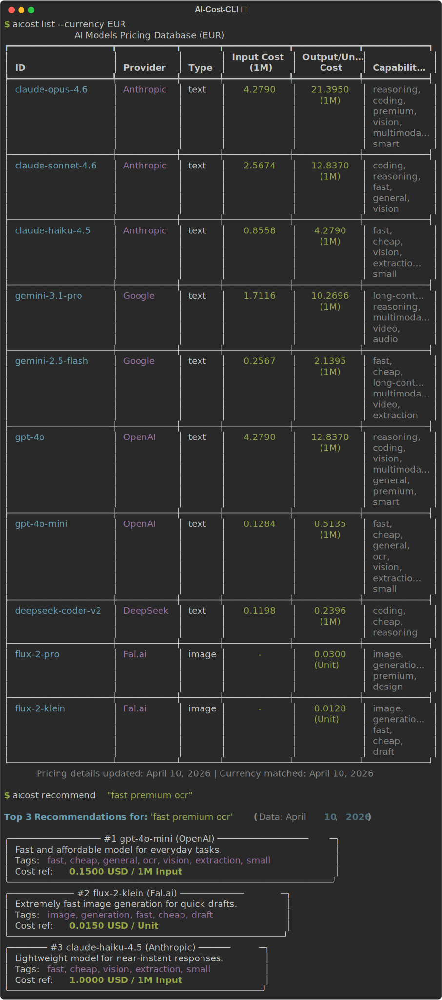

# AI-Cost-CLI 🚀💸


> **Terminal-based AI API Cost Calculator, Converter, and Recommendation Engine.**

Developing AI products and not sure which model API is the most cost-effective for your specific feature? **AI-Cost-CLI** helps you instantly calculate costs for multiple models, convert values to your local currency, and recommends the best model purely based on your task—all directly from your terminal.

## ✨ Features
1. **Cost Calculator:** Calculate costs instantly based on Input/Output tokens, or image generation parameters.
2. **Recommendation Engine:** Not sure what to use? Explain your task (`ocr`, `cheap vision`, `complex reasoning`) and let the tool recommend the best Return-on-Investment model for you.
3. **Currency Conversion:** Native integration with free exchange rates. Input `USD` output `TRY`, `EUR`, etc.
4. **Agent Integration (MCP):** Acts as a [Model Context Protocol](https://modelcontextprotocol.io/) (MCP) tool server out of the box. Meaning other agents like Claude Desktop can connect and use it!
5. **Community Driven / Zero Server Costs:** Powered by a clean, local `pricing.json` file. Updating prices is as simple as making a quick Pull Request.

## 🚀 Quick Start (Demo)


## 📦 Installation

To test locally right now:
```bash
git clone https://github.com/ufhouck/aicost.git
cd aicost
pip install -e .
```

Now you can use the `aicost` command anywhere on your system!

## 💻 CLI Usage

### View the complete pricing database
```bash
aicost list
aicost list --currency EUR
```

### Calculate Cost
```bash
# Calculate token-based cost
aicost calc gpt-4o --input 1000000 --output 500000

# Calculate target currency cost
aicost calc claude-3-5-sonnet --input 500 --output 2000 --currency TRY

# Image/Unit calculations 
aicost calc flux-1-pro --units 10
```

### Task-Based Recommendations
```bash
aicost recommend "fast cheap ocr extraction"
aicost recommend "premium complex reasoning coding task" --currency TRY
```

### MCP Server (For AI Agents)
```bash
aicost mcp
```

## 🤝 Contributing to `pricing.json`
We want to support all popular AI APIs. Updating models is meant to be completely decoupled from the code.
1. Fork the repo.
2. Edit `data/pricing.json`.
3. Create a Pull Request.

Example node:
```json
{
  "id": "gpt-4o-mini",
  "provider": "OpenAI",
  "type": "text",
  "cost_per_1m_input_tokens": 0.15,
  "cost_per_1m_output_tokens": 0.60,
  "tags": ["fast", "cheap", "ocr", "vision"],
  "description": "Fast and affordable model for everyday tasks."
}
```

## 📄 License & Credits
Licensed under MIT. 
Developed by **Ufuk Aydın**.
- LinkedIn: [ufukaydin](https://linkedin.com/in/ufukaydin)
- Website: [ufukaydin.com](http://www.ufukaydin.com)
